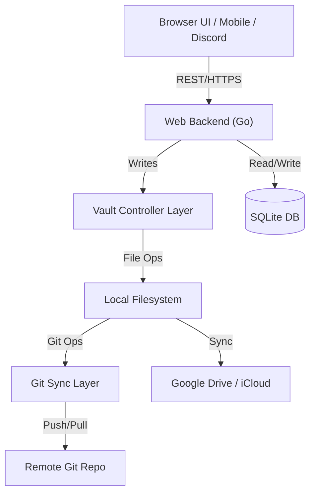

# Design Document: GTD Obsidian Vault Manager

## 1. Overview
The goal is to build a backend system to manage a GTD (Getting Things Done) Obsidian vault. The system will handle synchronization (Git, Cloud), provide a REST API for AI-driven transformations (ideas to inbox, reviews), and integrate with external communication channels (Gmail, Discord/WhatsApp).

## 2. Architecture
The system follows a layered architecture as proposed:

### 2.1. Web Backend (Go)
- **Role**: Entry point for all external interactions.
- **Responsibilities**:
    - HTTP Server (Standard `net/http` with Go 1.22+ multiplexer).
    - Authentication/Authorization (Single user initially, extensible design).
    - AI Prompt Orchestration (Gemini initially, extensible to OpenAI/Anthropic).
    - GTD Logic (Review schedules, inbox processing rules).
    - Integrations (Gmail polling/webhooks, Discord bot).
    - **State Management**: SQLite database for tracking review history, user preferences, and job status.

### 2.2. Vault Controller Layer
- **Role**: Abstraction over the Obsidian Vault file structure.
- **Responsibilities**:
    - Reading/Writing Markdown files.
    - Parsing/Updating YAML Frontmatter.
    - Applying Templates.
    - Routing content to specific folders (Inbox, Projects, Calendar).
    - Maintaining Vault integrity (links, tags).

### 2.3. Git Sync Layer
- **Role**: Version control and backup.
- **Responsibilities**:
    - Automated commits (e.g., on change or scheduled).
    - Push/Pull to remote repository.
    - Basic conflict resolution (e.g., "ours" vs "theirs", or notify).

## 3. Key Features & Data Flow

### 3.1. AI-Driven Inbox Processing
- **Input**: Raw text (idea), Voice transcript, or Email content.
- **Process**:
    1.  **Receive**: API endpoint receives input.
    2.  **Analyze**: AI analyzes content to determine type (Task, Project, Reference, Calendar Event).
    3.  **Transform**: AI formats content using specific Obsidian Templates (e.g., `Inbox Item Template`, `Next Action Template`).
    4.  **Context Inference**: AI suggests contexts (`@calls`, `@computer`) and tags (`#high-energy`, `#5min`) based on content.
    5.  **Write**: Vault Controller writes to `1. Inbox` or specific folder.
    6.  **Sync**: Git Sync layer commits changes.

### 3.2. GTD Reviews (Daily/Weekly)
- **Trigger**: Cron job or API call.
- **Tracking**: SQLite database tracks when reviews were last generated.
- **Automation**: Automatic review generation is an **opt-in** feature.
- **Process**:
    1.  **Gather**: Vault Controller scans `1. Inbox` (for remaining items), `3. Projects` (for active projects), `2. Next Actions`.
    2.  **Synthesize**: AI generates a summary/review document using the `Weekly Review Template`.
    3.  **Dynamic Population**: The system automatically lists all active projects in the "Project Review" section of the template, checking their status.
    4.  **Present**: JSON response to UI or writes a "Review" note in `6. Weekly Reviews`.

### 3.3. Gmail Integration
- **Mechanism**: Gmail API (Polling or Push).
- **Process**:
    1.  **Fetch**: Retrieve new emails.
    2.  **Filter**: AI decides if email is actionable.
    3.  **Action**:
        -   If actionable -> Create Task in `1. Inbox` or `2. Next Actions` (with link to email).
        -   If reference -> Archive to `5. Reference` or just tag in Gmail.
        -   If junk -> Ignore.

### 3.4. Chat Integration (Discord/WhatsApp)
- **Mechanism**: Bot interface.
- **Capabilities**:
    -   "Add to inbox: [text]"
    -   "What's on my plate today?" (Queries `2. Next Actions` with `status: next`)
    -   "Log completed task: [task]"

## 4. Data Model & Templates
The system must adhere to the existing Vault structure and Frontmatter schema.

### 4.1. Directory Structure
- `0. GTD System/`: Documentation & Templates
- `1. Inbox/`: Incoming items
- `2. Next Actions/`: Actionable tasks by context
- `3. Projects/`: Active projects
- `4. Someday Maybe/`: Deferred items
- `5. Reference/`: Knowledge base
- `6. Weekly Reviews/`: Review logs

### 4.2. Key Frontmatter Fields
- **Common**: `created`, `tags`, `priority`
- **Inbox**: `status: inbox`, `type: [task/idea/...]`
- **Project**: `status: [planning/active/...]`, `due_date`, `review_date`
- **Next Action**: `status: [next/waiting/...]`, `context: [@calls/@computer/...]`, `project: [[Link]]`
- **Review**: `type: weekly-review`, `week_of`

## 5. Technology Stack
- **Language**: Go (Golang)
- **Web Framework**: Standard `net/http` (Go 1.22+ path-based routing).
- **Markdown Processing**: `goldmark` or similar Go markdown library.
- **Git Integration**: `go-git`.
- **AI Integration**: Google Gemini (primary), extensible to OpenAI/Anthropic.
- **Database**: SQLite (with migration layer e.g., `golang-migrate` or `goose`) for metadata, review tracking, and job history.
- **Authentication**: Single-user initially, prepared for JWT/OAuth.
