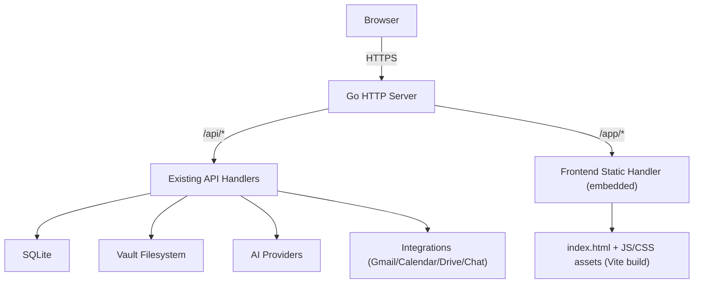

# Life-Pilot Frontend Design (Embedded in Go Binary)

## 1. Goal

Build a modern frontend for Vault Pilot that is:

- Embedded into the Go server binary.
- Served by dedicated HTTP handlers.
- Developed with Bun + Vite + React + TypeScript + shadcn/ui.
- Focused on GTD workflows: inbox, tasks, projects, calendar, automations, and AI chat.

This document defines the target architecture, app structure, and functional scope for implementation.

## 2. High-Level Architecture



### Runtime model

- Backend remains the system-of-record for vault/automation state.
- Frontend is a thin client calling JSON APIs.
- SPA routes are served from an embedded filesystem using fallback-to-`index.html`.

## 3. Tech Stack

## `Frontend`
- `bun` for package/runtime/tooling.
- `vite` for dev server and production build.
- `react` + `typescript`.
- `react-router` for SPA routing.
- `@tanstack/react-query` for API state caching and retries.
- `zod` for runtime schema validation of API responses.
- `shadcn/ui` + `tailwindcss` for UI system.
- `lucide-react` for iconography.

## `Backend integration`
- Go `embed` package for static bundling.
- Dedicated handler for frontend assets and SPA route fallback.
- Existing Go API remains under `/api`.

## 4. Project Layout

```text
web/
  src/
    app/
      router.tsx
      providers.tsx
      layout/
    pages/
      dashboard/
      calendar/
      vault/
      tasks/
      projects/
      automations/
      chat/
      settings/
    components/
      ui/               # shadcn generated
      feature/
      shared/
    lib/
      api/
      schemas/
      utils/
  index.html
  package.json
  bun.lockb
  vite.config.ts
  tsconfig.json
  tailwind.config.ts

pkg/web/
  handler.go           # dedicated frontend handler
  embed.go             # //go:embed dist/*
```

## 5. Build and Embed Flow

## `Development`
- Run Go API and Vite dev server separately.
- API served by Go (e.g. `:8080`), Vite (e.g. `:5173`).
- Vite proxy forwards `/api` to Go backend.

## `Production build`
1. `bun install`
2. `bun run build` (outputs `web/dist`)
3. Go build embeds `web/dist/**`.
4. Single binary serves API and frontend.

## `Makefile targets (recommended)`
- `make web-dev`
- `make web-build`
- `make build` (web build + Go build)
- `make test`

## 6. Go Serving Strategy

## `Route boundaries`
- `/api/*`: backend JSON handlers.
- `/app/assets/*`: static asset files.
- `/app/*`: SPA index fallback.
- `/`: optional redirect to `/app`.

## `Dedicated handler responsibilities`
- Serve immutable asset files with cache headers for fingerprinted bundles.
- Serve `index.html` for app routes.
- Prevent path traversal and enforce MIME types.
- Return health diagnostics for missing embedded assets on startup.

## 7. Frontend App Architecture

## `Routing`
- `/app/dashboard`
- `/app/calendar`
- `/app/vault`
- `/app/tasks`
- `/app/projects`
- `/app/automations`
- `/app/chat`
- `/app/settings`

## `State model`
- Server state: React Query + typed API clients.
- UI/session state: React context (theme, sidebar, filters).
- Form state: React Hook Form + zod resolver.

## `Data access`
- Shared `apiClient` with:
  - request/response typing,
  - standardized error mapping,
  - auth token hook (future),
  - request tracing headers (optional).

## 8. Functional Features

## `A. Dashboard`
- Daily overview cards:
  - inbox count,
  - due/next tasks,
  - active projects,
  - today automations.
- Timeline widget for scheduled automations.
- Recent activity feed (automation runs + vault changes).

## `B. Calendar View`
- Week and month views.
- Display planned tasks, review reminders, and events.
- Quick-create action from timeslot.
- Filter by source (GTD task, automation, external calendar).

## `C. Vault Preview`
- File tree for GTD folders.
- Markdown preview panel with frontmatter summary.
- Search and quick open.
- Read-first mode for v1 (editing can come later).

## `D. Tasks/Todos`
- Inbox triage queue.
- Next Actions by context.
- Task detail drawer (status, priority, links, tags).
- Bulk operations (move, mark done, defer).

## `E. Projects`
- Project list with status chips and progress.
- Project detail page:
  - linked next actions,
  - milestones,
  - notes/reference links.
- Review cadence indicators (needs review, overdue).

## `F. Automations Config`
- List automations with run state and schedule.
- Create/edit automation definitions:
  - action type,
  - schedule kind (`cron` | `interval` | `oneshot`),
  - schedule expression,
  - timezone,
  - payload JSON editor.
- Run-now, pause/resume, recent run logs.

## `G. Chat`
- AI chat panel tied to vault context.
- Command-like shortcuts:
  - "create task",
  - "summarize day",
  - "supervise coding session".
- Conversation history (local + backend persisted later).

## `H. Settings`
- Provider status (AI, integrations).
- Vault path/health diagnostics (read-only if needed).
- Feature flags and UI preferences.

## 9. API Evolution Needed for Frontend

Current backend endpoints are minimal. Frontend requires expanded APIs:

- `GET /api/dashboard`
- `GET /api/calendar?from=...&to=...`
- `GET /api/vault/tree`
- `GET /api/vault/file?path=...`
- `GET /api/tasks`, `PATCH /api/tasks/{id}`
- `GET /api/projects`, `GET /api/projects/{id}`
- Existing automation APIs (already started):
  - `GET /api/automations`
  - `POST /api/automations`
  - `PATCH /api/automations/{id}`
  - `POST /api/automations/{id}/run-now`
- `GET /api/automations/{id}/runs`
- `POST /api/chat`

Recommendation: add versioned namespace before UI launch (`/api/v1/*`) to avoid future breaking changes.

## 10. Security and Reliability

- Validate all API payloads server-side.
- Sanitize vault file path access (allowlist root, no `..` traversal).
- Rate-limit chat/automation trigger endpoints.
- Attach request IDs for traceability.
- Add optimistic UI carefully for mutation-heavy views (tasks/automations).

## 11. UI Direction

- Strong, editorial productivity aesthetic:
  - warm neutral base,
  - high-contrast data accents (teal/amber/red),
  - dense but readable information panels.
- Typography:
  - headings with `Manrope`,
  - body with `IBM Plex Sans`.
- Motion:
  - subtle page enter transitions,
  - timeline/automation status change animation only.
- Mobile:
  - adaptive navigation (sheet-based),
  - dashboard + tasks first-class,
  - read-only vault browsing in v1.

## 12. Delivery Phases

1. Foundation: web scaffold, embed handler, shell layout, API client, auth placeholder.
2. Core productivity: dashboard + tasks + projects.
3. Planning: calendar + vault preview.
4. Operations: automations UX + run logs.
5. Intelligence: chat and workflow shortcuts.
6. Hardening: accessibility, performance, E2E tests, observability.

## 13. Definition of Done (Frontend)

- Single Go binary serves working SPA and API.
- Lighthouse perf score acceptable on dashboard route (target >= 85 in local baseline).
- Core paths tested:
  - create/edit automation,
  - triage task,
  - open vault note,
  - run chat command.
- No blocking console errors in production mode.
- Keyboard navigation and basic screen reader labels implemented for all primary controls.
