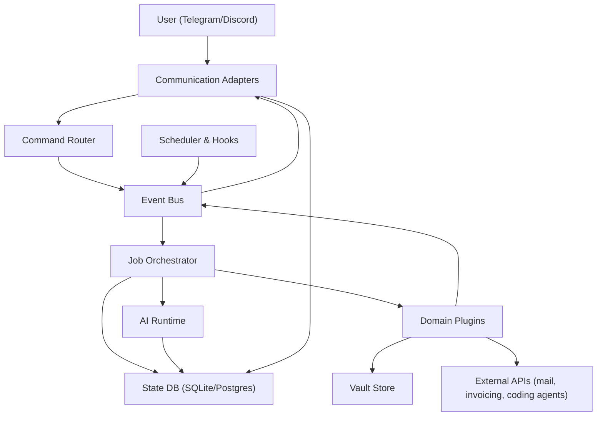

# Go Monolith Plugin Architecture for Vault Pilot

## 1. Purpose

This document describes the target architecture after the switch to a **Go-first, single-codebase model**.

The system is split into:

- A **core application** that provides platform capabilities.
- A set of **domain plugins/features** (email, GTD vault, finance/business, software execution, etc.).

The goal is to keep plugin development fast and safe in Go, while avoiding Go's operational complexity around external binary plugins (`plugin` package portability, ABI coupling, deployment friction).

## 2. Core Design Decision

### Decision

Use **internal plugins** (Go packages compiled into one binary) instead of external runtime-loaded binaries.

### Why this is the right choice now

- Predictable builds and deployments across macOS/Linux.
- No ABI mismatch issues from separately compiled shared objects.
- Easier observability and debugging (single process, shared tracing/logging).
- Simpler security model (no arbitrary dynamic module loading).
- Faster iteration for early product-stage architecture changes.

### Tradeoff accepted

- New plugins require rebuilding and redeploying the binary.

This is acceptable for the current phase because stability and maintainability are more important than independent plugin distribution.

## 3. Functional Boundaries

### 3.1 Core Application Responsibilities

The core app owns generic, reusable capabilities:

1. AI integration and prompt execution
2. Scheduling and hooks
3. User communication channels
4. Event routing and job orchestration
5. Observability, policy, and cost controls

### 3.2 Plugin Responsibilities

Each plugin owns domain logic only:

- Email plugin: mailbox reads, message classification, `mail.*` event emission.
- GTD plugin: task/project/calendar extraction and vault writes.
- Business plugin: invoice detection and invoicing-system integration.
- Software plugin: project-task selection and coding-agent job execution.
- Future plugins can be added with the same contract.

## 4. Architectural View



## 5. Package-Level Blueprint (Go)

Suggested package layout for a single codebase:

- `/cmd/server` - process entrypoint, config, wiring.
- `/internal/core/app` - dependency graph and startup lifecycle.
- `/internal/core/events` - event envelope, event bus, subscriptions.
- `/internal/core/commands` - user command model + dispatcher.
- `/internal/core/scheduler` - recurring schedules and ad-hoc jobs.
- `/internal/core/jobs` - async job execution and retries.
- `/internal/core/ai` - provider abstraction, prompt runner, token budgets.
- `/internal/core/comms` - channel abstractions and adapters.
- `/internal/core/policy` - permissions, allowed tools/actions.
- `/internal/core/store` - state repositories.
- `/internal/plugins/email` - email feature module.
- `/internal/plugins/gtd` - vault/GTD feature module.
- `/internal/plugins/business` - business/invoicing feature module.
- `/internal/plugins/software` - software-task feature module.
- `/internal/plugins/registry` - compile-time plugin registration.

## 6. Contracts

### 6.1 Event Envelope

All domain and system communication uses one envelope.

```go
type Event struct {
    ID            string
    CorrelationID string
    Source        string
    Type          string
    OccurredAt    time.Time
    Payload       json.RawMessage
    Metadata      map[string]string
}
```

Rules:

- `ID` is unique and immutable.
- `CorrelationID` links a workflow across plugins.
- `Type` follows namespaced conventions (`mail.received`, `gtd.task.created`).
- `Payload` is versioned per event type.

### 6.2 Command Contract

```go
type Command struct {
    ID            string
    CorrelationID string
    Channel       string
    SenderID      string
    Name          string
    Args          map[string]string
    RawText       string
    ReceivedAt    time.Time
}
```

Command examples:

- `software find-task --project=X`
- `inbox save ...`

### 6.3 Plugin Contract (internal)

```go
type Plugin interface {
    ID() string
    Register(ctx context.Context, r Registrar) error
    Start(ctx context.Context) error
    Stop(ctx context.Context) error
}

type Registrar interface {
    OnEvent(eventType string, handler EventHandler)
    OnCommand(command string, handler CommandHandler)
    AddSchedule(spec ScheduleSpec, callback ScheduledCallback)
}
```

## 7. Scenario Mapping

## 7.1 Scenario 1: Email fanout to GTD + Business

Flow:

1. Email plugin schedule triggers mailbox pull.
2. Email plugin emits `mail.received` events.
3. GTD plugin subscribes to `mail.received` and extracts tasks/calendar/projects.
4. Business plugin subscribes to `mail.received` and extracts invoices.
5. Both plugins emit user-facing events (`gtd.insight.created`, `business.invoice.processed`).
6. Communication adapters send concise user notifications.

Key controls:

- Idempotency key based on mailbox message ID.
- First-pass rule/classifier before expensive LLM extraction.
- Duplicate suppression for repeated sync windows.

## 7.2 Scenario 2: `software` command and async agent execution

Flow:

1. User sends `software` command via Telegram/Discord.
2. Communication adapter converts message to `Command`.
3. Command router dispatches to software plugin handler.
4. Software plugin starts a `job.software.run` async job.
5. Job orchestrator invokes configured coding agent backend.
6. Progress events and final result events are published.
7. Communication layer pushes completion summary to user.

Key controls:

- Job timeout, cancellation, and retry policy.
- Tool/action policy checks before execution.
- Artifact storage of logs/results per job.

## 7.3 Scenario 3: `inbox` command to capture thought

Flow:

1. User sends `inbox` command.
2. GTD plugin receives command and enriches context.
3. Plugin writes normalized note to vault inbox.
4. Plugin emits `gtd.inbox.captured`.
5. Communication adapter confirms capture to user.

Key controls:

- Deterministic formatting template for low token usage.
- Optional LLM usage only for explicit enrichment requests.

## 8. Token and Cost Governance

This architecture is viable without runaway token burn if enforcement is built into core.

Controls:

1. Two-stage processing: rule-based triage first, LLM second.
2. Model routing: cheap model for classify/extract, stronger model only when needed.
3. Context minimization: pass only relevant snippets, not full history.
4. Caching: deduplicate repeated prompts by content hash + task type.
5. Budgets: per-plugin daily token and cost caps.
6. Graceful degradation: fallback to rules when budget is exceeded.
7. Batch jobs for high-volume channels (mail triage windows).

## 9. Reliability and Safety

### Reliability

- At-least-once event delivery with idempotent handlers.
- Dead-letter queue for unrecoverable handler errors.
- Persisted schedule cursor and last-run status.
- Structured retries with jittered backoff.

### Safety

- Plugin-scoped permissions for external tools and APIs.
- Redaction of sensitive data in logs.
- Explicit allowlist of domains/tools per plugin.
- Human-confirmation mode for high-risk actions (payments, destructive git operations).

## 10. Data Storage

Minimum persistent state:

- Event log / dedup table.
- Job table (`pending`, `running`, `done`, `failed`, `canceled`).
- Schedule definitions and last-run markers.
- Plugin state checkpoints (cursor offsets, mailbox sync tokens).
- Token/cost accounting records.

SQLite is sufficient initially. Move to Postgres when concurrent workers or high event volume requires it.

## 11. Observability

Required from day one:

- Correlation IDs across commands, events, jobs, and AI calls.
- Structured logs with plugin and event type tags.
- Metrics:
  - events/sec per type
  - handler latency and error rates
  - job queue depth and age
  - token and cost per plugin and model
- Trace sampling for long workflows.

## 12. Evolution Path (Later)

When independent plugin deployment becomes necessary, keep contracts stable and move from internal packages to one of:

- gRPC sidecar services per plugin.
- WASM sandbox execution for selected plugin logic.
- Message-queue-based out-of-process workers.

Because the internal contract is already event-driven and command-driven, migration can happen without changing user-facing behavior.

## 13. Summary

The architecture switch is viable and well aligned with your requirements.

Using a Go monolith with internal plugins provides:

- Clear separation of core platform vs domain features.
- Reliable orchestration for your three scenarios.
- Controlled token usage through centralized governance.
- A clean path to out-of-process plugins later, without overengineering now.
